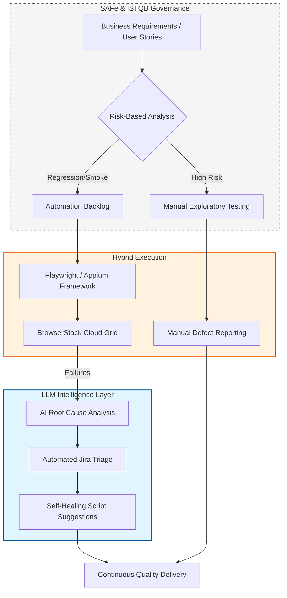

# 🚀 QA Transformation Roadmap

> **A Strategic Vision for AI-Accelerated Quality Engineering**

This document defines a strategic roadmap for evolving a QA team from a traditional, reactive testing model into a **modern, AI-accelerated Quality Engineering ecosystem**. The approach is grounded in the TMMi maturity model and aligned with SAFe and ISTQB standards to ensure consistency, governance, and scalability.

---

## 🎯 The Vision: Hybrid Intelligence

The objective is to establish a **Risk-Based, AI-Accelerated Ecosystem** that combines the analytical judgement of manual QA with the speed and scalability of automation. This hybrid model enables rapid release cycles while maintaining confidence in product quality and stability.

---

## 🗺️ The Strategic Workflow

The roadmap is underpinned by an integrated architecture that connects governance, execution, and AI-driven acceleration across the delivery lifecycle.

## 📈 TMMi Maturity Matrix (From Level 1 to Level 5)

This matrix defines the quality engineering capabilities required to progress from a **reactive, test-after-build approach (Level 1)** to a **fully optimised, continuously improving Quality Engineering function (Level 5)**.

| Pillar | Level 1 (Initial / Baseline) | Level 5 (Optimised Target) |
| :--- | :--- | :--- |
| **Shift Left** | QA engagement occurs after development is complete. | **PI Planning Integration:** Test dependencies, quality risks, and data requirements are identified *before* PI planning begins. |
| **Test Pyramid** | Testing relies heavily on slow, brittle UI-based automation. | **Balanced Pyramid:** Test distribution aligns with the ideal pyramid across unit, integration, and UI layers. |
| **Maintainability** | Automation scripts accumulate unchecked technical debt over time. | **Continuous Pruning:** Test suites are reviewed, refactored, and pruned every sprint to remove redundancy and improve signal. |
| **Manual Testing** | Ad-hoc, unscripted defect hunting with limited objectives. | **Chartered Exploratory Testing:** Manual testing is structured around defined charters with clear goals and outcomes. |
| **Accessibility** | Accessibility validation is absent or performed late. | **Shift-Left A11y:** Developers perform pre-commit accessibility checks using tooling such as Axe or WAVE. |
| **Observability** | Generic failure messages provide limited diagnostic insight. | **Actionable Insights:** Dashboards surface meaningful metrics with clear ownership and defined follow-up actions. |
| **Test Failures** | Flaky tests are re-run, ignored, or quarantined indefinitely. | **RCA Governance:** A formal Root Cause Analysis (RCA) process is mandatory for every test failure. |
| **CI/CD Pipeline** | Automation is executed locally or on demand. | **Fully Integrated CI/CD:** Automated tests are embedded into build pipelines (e.g. GitHub Actions, Jenkins). |
| **Run Times** | Test suites execute overnight, delaying feedback to teams. | **The 10-Minute Rule:** Critical pipeline suites complete within 10 minutes to enable rapid decision-making. |

## 🛠️ Implementation Plan: The "3-Step Pivot"

### Step 1: Governance & Foundation (Months 1–2)

* **Implement RCA Process:** Establish a mandatory Root Cause Analysis process to eliminate flaky tests, ensure failures are investigated properly, and prevent repeat issues.
* **Establish Shift-Left Protocol:** Require QA Lead sign-off on test dependencies, data needs, and quality risks during PI planning to ensure quality is embedded from the outset.

---

### Step 2: Technical Hardening & Integration (Months 3–4)

* **Migrate to CI/CD:** Move all locally executed automation into a centralised CI/CD pipeline to ensure consistent execution and visibility.
* **Enforce the 10-Minute Rule:** Parallelise and shard test suites using modern tooling (e.g. Playwright) to guarantee fast, actionable feedback.
* **Integrate Accessibility (A11y):** Embed automated accessibility checks into the developer pre-commit workflow to shift accessibility validation left.

---

### Step 3: Optimization & Continuous Improvement (Ongoing)

* **Quarterly Pruning Workshops:** Regularly review automation suites and remove tests that are redundant, low value, or have not failed in over six months.
* **Adopt Exploratory Charters:** Shift manual testing away from repetitive scripted execution toward high-value, chartered exploratory testing focused on risk and learning.

---

## 📊 Success Metrics (KPIs)

* **TMMi Scorecard:** Conduct quarterly maturity assessments to track progression from Level 1 through Level 5.
* **Release Velocity:** Increase the number of releases supported per month without introducing additional hardening or stabilisation phases.
* **Defect Leakage:** Maintain a defect leakage rate of less than **2%** while accelerating delivery cadence.
